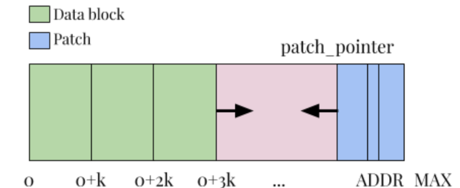

# relaxase
## Relaxase: An Updatable DNA-based Data Storage Framework

DNA-based data storage systems promise extreme data density. However in such systems, writing data means synthesizing DNA and DNA synthesis is very expensive. Thus, discarding DNA pools when just one file needs to be changed, is out of discussion. So, updates to existing data should use minimal writes. Reading from DNA is another non-trivial process. So an updatable design should aim minimal reads too. Currently available data patching methodologies generally expose the data content. Since, DNA data storage providers are not necessarily trustful entities, such an updatable data storage framework should also be privacy preserving. 

We propose an updatable DNA-based data storage framework that aims to minimize the amount of data to be written to and read from the storage. To achieve minimal reads and writes, the design will consist of a file-system-like infrastructure that does not perform unnecessary table look-ups to locate regions with changes. We are going to extend currently available DNA-based data storage systems to make them support updates in stored data. Updates in regular digital storage systems are simply overwriting bits. Overwriting bits may be analogous to modifying molecules inside the DNA pool however, our system will not perform molecule editing. Instead, a storage scheme is going to be designed so that we can apply new writes to certain regions locally without replacing entire files. Each file (that is mapped to a primer) is going to be partitioned into blocks of size k.

The address space will consist of data “blocks” that are encrypted individually. Each update will correspond to an encrypted patch file and be applied to the plaintext, not the encrypted data. Patches and data may be encrypted with the same key and only the user has the encryption keys. Since we want to avoid large patches, each patch will correspond only to a single data block. We start inserting the patches from the end of the address space and new patches will be stacked right after the last patch. This location is indicated by a “patch pointer” and it will be stored together with the file identifying primers, not in the DNA. Every patch needs to be applied in order to get the final version of the file. If no patches are applied, then we have the initial version. Sufficiently uniform molecule densities must also be maintained with each patch added to the pool.

